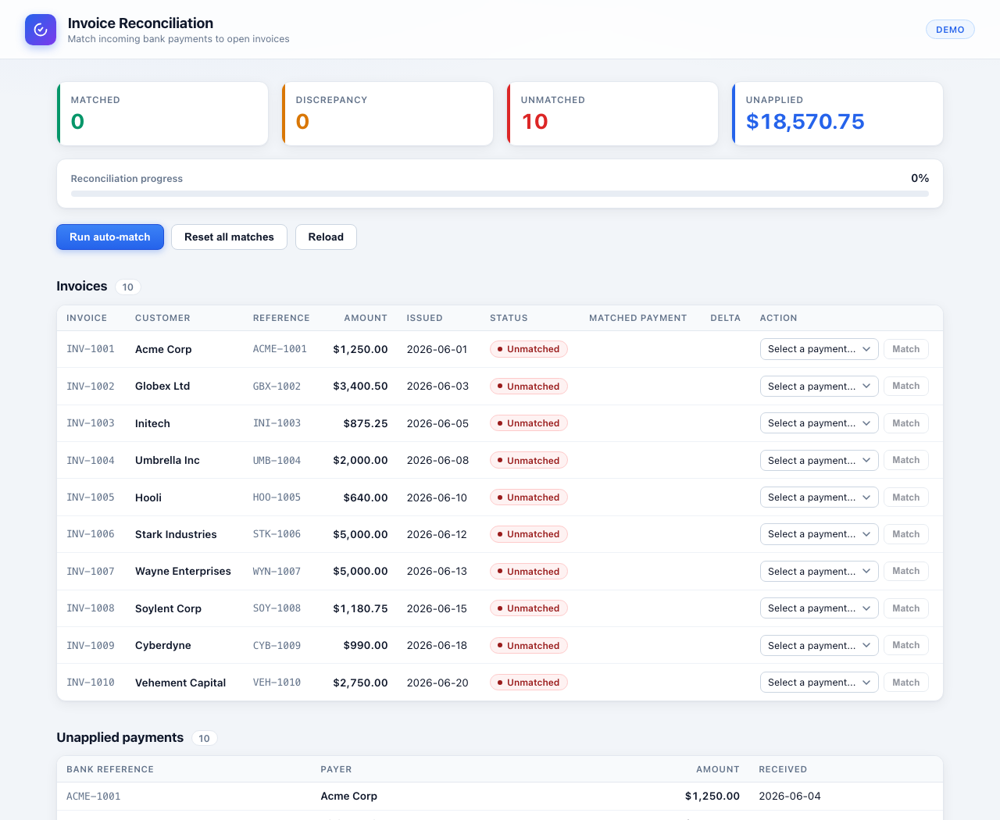
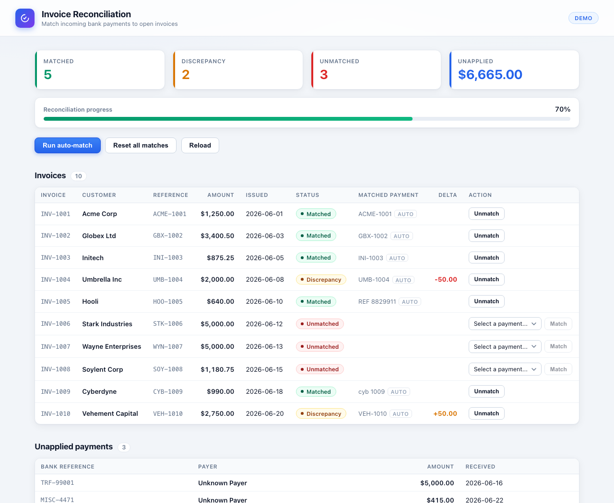

# Invoice Reconciliation — Blazor PoC

[](https://github.com/8exgh/blazor_sqlserver_entity_framework/actions/workflows/tests.yml)

Created by **Sean Bennett**.

A minimal proof-of-concept demonstrating one feature: reconciling customer invoices against
incoming bank payments. Blazor Web App (interactive server rendering) on .NET 10, EF Core against
SQL Server. Unit-tested with xUnit, end-to-end-tested with Playwright in Docker, CI on GitHub
Actions (results badge above).

## Screenshots

Fresh seed data, nothing reconciled yet:



After one click of **Run auto-match** — clean matches, discrepancies with signed deltas,
and the ambiguous cases deliberately left for a human:



## Run it

```bash
docker compose up -d                      # SQL Server 2022 on localhost:1433
dotnet run --project InvoiceRecon         # then open the URL it prints
dotnet test                               # unit tests, no Docker required
```

The app creates the `InvoiceRecon` database and seeds ~10 invoices and ~10 payments on first
start. It retries for up to a minute while the SQL container finishes booting, so you can run
both commands back to back.

To start over from an empty database: `docker compose down -v && docker compose up -d`.

## The feature

Everything lives on one page (`Components/Pages/Reconcile.razor`):

- **Run auto-match** applies three passes of decreasing confidence, each working only on what
  earlier passes left behind:
  1. Normalized reference *and* amount agree.
  2. Reference agrees, amount does not — still matched, flagged as a **Discrepancy** with the delta.
  3. No usable reference, so fall back to amount — but only when exactly one invoice and one
     payment share that amount. Ambiguous amounts are deliberately left for a human.
- **Manual matching**: any unmatched invoice can be paired with an unapplied payment from the
  dropdown, or unpaired again with **Unmatch**.
- **Reset all matches** clears everything so the demo can be re-run.

References are normalized by upper-casing and stripping non-alphanumeric characters, so a bank
reference of `cyb 1009` matches an invoice reference of `CYB-1009`.

The seed data is arranged so a single auto-match run produces every outcome: 4 clean matches,
2 discrepancies (one short payment, one overpayment), 1 amount-only match, 2 invoices sharing an
amount that the engine correctly declines to guess at, 1 invoice nobody paid, and 2 payments with
no matching invoice.

## Layout

| Path | |
|---|---|
| `docker-compose.yml` | SQL Server container for local development |
| `InvoiceRecon/Models/` | `Invoice`, `Payment`, `MatchKind` |
| `InvoiceRecon/Data/AppDbContext.cs` | DbSets, decimal precision, unique index on the match |
| `InvoiceRecon/Data/DbInitializer.cs` | retrying `EnsureCreated` + demo seed |
| `InvoiceRecon/Services/ReconciliationService.cs` | the matching engine |
| `InvoiceRecon/Components/Pages/Reconcile.razor` | the UI |
| `InvoiceRecon.Tests/` | xUnit tests for the matching engine |
| `InvoiceRecon.E2E/` | Playwright browser tests against the running app |
| `Dockerfile` | the app, published for containers |
| `Dockerfile.e2e` | Playwright runner with Chromium baked in |
| `docker-compose.e2e.yml` | SQL Server + app + Playwright, one command |
| `.github/workflows/tests.yml` | CI: unit tests + dockerized e2e tests |
| `terraform/` | sample Azure deployment — App Service + Azure SQL, never applied for real |

## Tests

### Unit tests

`dotnet test` — 24 xUnit tests, all Arrange/Act/Assert with FluentAssertions, covering the
matching engine and the derived row status. (The Playwright suite in the same solution skips
itself unless `E2E_BASE_URL` is set, so this stays Docker-free.)

They run against a fresh **SQLite in-memory** database per test rather than SQL Server, so the
suite needs no Docker and finishes in under a second. The tradeoff is that they exercise EF Core
and the service logic, not SQL Server specifics — the filtered unique index and `decimal(18,2)`
behave differently there. All amount comparisons happen in memory rather than in SQL, so SQLite's
lack of a decimal type does not affect what is under test.

What they pin down:

- Each auto-match pass in isolation, including reference normalization (`cyb 1009` matches
  `CYB-1009`) and the signed delta on over- and under-payments.
- The cases the engine must *refuse* to guess at: two invoices sharing an amount, two payments
  sharing an amount.
- Pass ordering — a payment claimed on reference is not available to a later amount-only match.
- That a run ignores invoices and payments that are already reconciled, and is idempotent.
- Manual match/unmatch/reset, including two users racing for the same payment.
- A golden test asserting the shipped demo seed produces exactly the 4/2/1 outcome documented
  above, so changing the seed or the engine surfaces immediately.

### End-to-end tests (Playwright)

`InvoiceRecon.E2E/` drives the real app in headless Chromium: auto-match produces the documented
4/2/1 outcome on screen, a second run is a no-op, manual match/unmatch round-trips, reset clears
everything, and discrepancy rows show signed deltas. The whole environment — SQL Server, the app,
and the Playwright runner — is containerized:

```bash
docker compose -f docker-compose.e2e.yml up --build --abort-on-container-exit --exit-code-from e2e
```

TRX results land in `./test-results`. To run the suite against an app you started yourself
(faster while iterating):

```bash
E2E_BASE_URL=http://localhost:5276 dotnet test InvoiceRecon.E2E
```

(One-time browser install: `pwsh InvoiceRecon.E2E/bin/Debug/net10.0/playwright.ps1 install chromium`,
or use the node bundled in the build output at `bin/Debug/net10.0/.playwright/`.)

### CI

`.github/workflows/tests.yml` runs both suites on every push and pull request: unit tests
directly on the runner, e2e tests via `docker-compose.e2e.yml`. The badge at the top of this
README reflects the latest run; TRX files are uploaded as build artifacts.

## PoC shortcuts

Deliberate, and what you would change first for anything real:

- `EnsureCreated()` instead of EF migrations — there is no schema-evolution story.
- The SA password is committed in `appsettings.json` and the compose files.
- Matching runs in memory over all open invoices and payments; fine for tens of rows, not for
  hundreds of thousands.
- One invoice maps to at most one payment. No partial payments, no one-payment-covers-many-invoices.
- No authentication and no audit trail.
- FluentAssertions is pinned to **7.2.2**, the last Apache-2.0 release. Version 8 moved to the
  Xceed Community License, which requires a paid licence for commercial use. If that is a problem,
  `AwesomeAssertions` is a drop-in fork of 7.x that stays Apache-2.0.

## Apple Silicon note

There is no arm64 SQL Server image, so both compose files pin `platform: linux/amd64` and
rely on Docker Desktop's Rosetta emulation (Settings → General → *Use Rosetta for x86/amd64
emulation*, on by default). If that gives you trouble, swap the image for
`mcr.microsoft.com/azure-sql-edge:latest` — the same environment variables apply.

---

Created by **Sean Bennett**.
